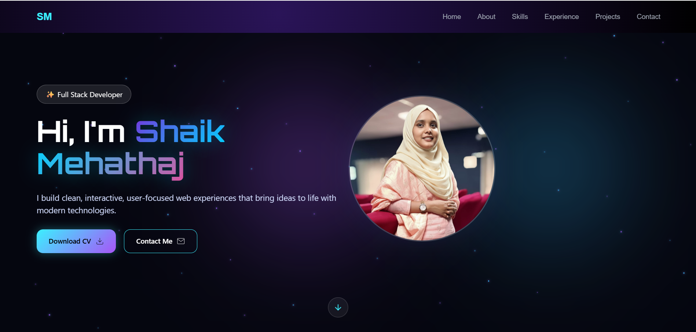

# Mehathaj Portfolio

This is a personal **developer portfolio website** created by **Shaik Mehathaj** using **Angular**.
The portfolio highlights projects, skills, and information about the developer.

The project follows a **component-based architecture** and is built using **Angular CLI**.

---

# Developer

**Shaik Mehathaj**


---

# Features

* Modern Angular portfolio website
* Responsive user interface
* Sections for Home, About, Projects, and Contact
* Clean component-based architecture
* Easy to customize and extend

---

# Application Screenshot

## Home Page

<p align="center">

</p>

---

# Technologies Used

* Angular
* TypeScript
* HTML
* CSS
* Node.js
* Angular CLI

---

# How to Run This Project

Follow the steps below to run this project on your computer.

---

## 1.Clone the Repository

Open your terminal and run:

git clone https://github.com/sk-thaj/mehathaj-portfolio.git

---

## 2️.Navigate to the Project Folder

cd mehathaj-portfolio

---

## 3️.Install Dependencies

Make sure **Node.js** and **Angular CLI** are installed.

Then run:

npm install

---

## 4️.Start the Development Server

Run the following command:

ng serve

---

## 5️.Open the Application

Open your browser and go to:

http://localhost:4200/

The application will automatically reload when you modify any source files.

---

# Important Note

Some files are intentionally **not included in this repository**:

* `src/app/components/contact/contact.ts`
* `google-fonts-main.zip`

These files were excluded to avoid publishing **large files and personal contact information** in the public repository.

---

# Adding the Contact Component (Optional)

If you want to recreate the contact component, run:

ng generate component contact

This will generate:

src/app/components/contact/contact.ts
src/app/components/contact/contact.html
src/app/components/contact/contact.css

You can then customize the component as needed.

---

# Project Structure

```
mehathaj-portfolio
│
├── screenshots
│   └── home.png
│
├── src
│   ├── app
│   │   ├── components
│   │   │   ├── home
│   │   │   ├── about
│   │   │   ├── projects
│   │   │   └── contact
│   │
│   ├── assets
│   └── index.html
│
├── package.json
├── angular.json
└── README.md
```
---

# Support

If you like this project, please consider **starring the repository on GitHub**.

---

© 2025 Developed by **Shaik Mehathaj**
